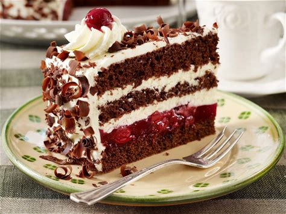

## Menu

[First Food Section](#first-food-section) | ... | [Beverages](#beverages)

## First Food Section

### German Food

| Name                 | Description                                                                                                                                                                                                                                                                                                                                                                                                                                                                                                                                                                                                                                                                                                                                                                                                        | Image                                          |           Price |
|:---------------------|:-------------------------------------------------------------------------------------------------------------------------------------------------------------------------------------------------------------------------------------------------------------------------------------------------------------------------------------------------------------------------------------------------------------------------------------------------------------------------------------------------------------------------------------------------------------------------------------------------------------------------------------------------------------------------------------------------------------------------------------------------------------------------------------------------------------------|------------------------------------------------|----------------:|
| Schweineschnitzel    | A schnitzel is a thin piece of meat pounded into a flat slice. You then bread the meat before frying it. You can eat deep-fried or pan-fried schnitzel. In Germany, they use mainly pork as the meat of choice. Wiener Schnitzel, which is more of an Austrian dish, is probably the most popular here in North America. This is a cutlet layered with ham and cheese and then breaded and pan-fried. A traditional Weiner Schnitzel is made with veal, but you can substitute whatever meat you like. Many Germans like to eat schnitzel with fried potatoes and cream sauces.                                                                                                                                                                                                                                    |                  |             259 |        |
|   Labskaus                   | Labskaus is a beef dish. German sailors in the 18th century developed it, and it became popular amongst many people on land. It is a combination of salted beef, onions, abd potatoes. These ingredients are mashed together and combined with gherkins and other ingredients like pickled beets. It resembles a pink mash, yet it is a good dish when you have leftover ingredients you want to combine together.                                                                                                                                                                                                                                                                                                                                                                                                 |                   |             500 |
|     Kartoffelknödel                         | Kartoffelknödel is the German term for potato dumplings. Potatoes serve as the base of the dumplings, but you can include any seasoning and croutons you like. The dumplings are then boiled. You can then put additional croutons on top, or you can eat your dumplings with your favorite sauce.                                                                                                                                                                                                                                                                                                                                                                                                                                                                                                                 |            |             290 |
|       Reibekuchen                       | Reibekuchen is German potato patties or pancakes. If you have had latkes before, you will find Reibekuchen very similar to them. You can grate potatoes and then combine them with eggs and flour. Once you form the mixture into patties, you can pan-fry them until crispy. Reibekuchen works as a side dish, and you can have them with apple sauce or minced meat.                                                                                                                                                                                                                                                                                                                                                                                                                                             |                |             259 |
|   Schwarzwälder Kirschtorte                           |    Schwarzwälder Kirschtorte, also known as Black Forest Cake, is a renowned German dessert that features layers of rich chocolate sponge cake, whipped cream, and cherries. The cake’s base is made from a moist chocolate sponge, which is complemented by the tartness of sour cherries, often soaked in Kirschwasser, a clear cherry brandy. Between the layers of cake, generous amounts of whipped cream are spread, adding to the cake’s creamy texture. The cake is then beautifully decorated with more whipped cream, chocolate shavings, and whole cherries on top, creating a visually appealing and deliciously balanced dessert that combines sweetness and tartness in every bite.                                                                                                                                                                                                                                                                                                                                                                                                                                                                                                                                                                                                                                                                                                                                                                                                                |  | 1,050 per whole |

## Beverages

| Name   | Description                                                                                                                                                                                                                                                                                                                                                                                                                                                                                                                                                        | Image                        | Price |
|:-------|:-------------------------------------------------------------------------------------------------------------------------------------------------------------------------------------------------------------------------------------------------------------------------------------------------------------------------------------------------------------------------------------------------------------------------------------------------------------------------------------------------------------------------------------------------------------------|------------------------------|------:|
| Yakult | Yakult is a dairy drink that was originally created in Japan. It is produced using a unique fermentation process which combines lactic acid bacteria and skimmed milk. The good bacteria in Yakult are of the well-known strain called Lactobacillus casei Shirota, discovered by Dr. Minoru Shirota, the founder of Yakult in 1930. The main ingredients in Yakult include water, non-fat milk, sugar, and the L. casei Shirota strain. Yakult contains no fat, gluten, or cholesterol, and it is quite low in calories, with around 43 calories per 65ml bottle. |  |     8 |