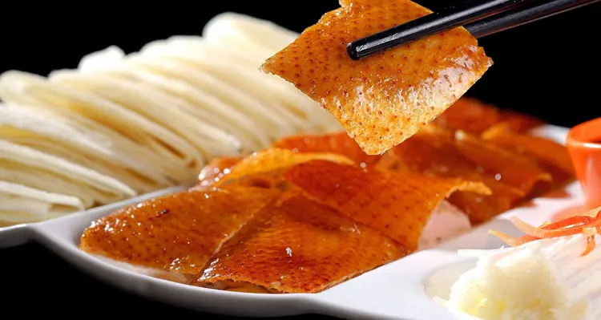

## Menu

[Chinese Food](#chinese-food) | [Beverages](#beverages)

## Chinese Food
|Food|Description|Image|Price (Baht)|
|:--|:--|:-:|--:|
|**Peking Roasted Duck**|Peking duck (北京烤鸭 Běijīng kǎoyā) is a famous dish from [Beijing](https://www.chinahighlights.com/beijing/), enjoying world fame, and considered as one of China national dishes. Peking duck is savored for its thin and crispy skin. Sliced Peking duck is often eaten with pancakes, sweet bean sauce, or soy sauce with mashed garlic. It is a must-taste dish in Beijing!  As "the first dish to taste in China", [Beijing Roast Duck](https://www.chinahighlights.com/beijing/food/beijing-duck.htm) used to be a royal dish in medieval China. It has been a "national dish of diplomacy" since the 1970s, when it was first used for the reception of foreign guests by Premier Zhou Enlai (the first Premier of the People's Republic of China). It is highly praised by heads of state, government officials, and domestic and foreign tourists.||1094.08|
|**Kung Pao Chicken**|Kung Pao Chicken (宫保鸡丁 gōngbào jīdīng) is a famous Sichuan-style specialty, popular with both Chinese and foreigners. The major ingredients are diced chicken, dried chili, cucumber, and fried peanuts (or cashews).  People (Chinese takeaways) in Western countries have created a Western-style kung pao chicken, for which the diced chicken is covered with cornstarch, and vegetables, sweet and sour sauce, and mashed garlic are added.||204.80|
|**Sweet and Sour Pork**|Sweet and sour pork (糖醋里脊 tángcù lǐjǐ) has a bright orange-red color, and a delicious sweet and sour taste. At the very beginning there was only sweet and sour pork, but to meet demands, there have been some developments on this dish. Now, the pork can be substituted with other ingredients like chicken, beef, or pork ribs.||363.24|
|**Hot Pot**|Hot pot, or [hotpot](https://www.chinahighlights.com/travelguide/chinese-food/hotpot.htm) (火锅 huǒguō), is one of the most popular dishes in China, especially in Sichuan Province or [Chongqing](https://www.chinahighlights.com/chongqing/). People cook in and eat from a simmering pot of soup stock (broth) on a gas/induction hob in the middle of the dining table with foodstuffs and condiments around the pot. People can add and cook whatever they like in the broth. The secret of whether a hot pot is good or not lies in the broth, which all the meat slices and vegetables take their flavor from.  Chinese people are very fond of hot pot. In the past hot pot used to be favored only in winter, but nowadays hot pot has been appearing on tables all year round. It is a great way to socialize with friends and relatives. People gather around the pot to eat while chatting, eating, drinking, and having fun.||1,025.70|
|**Dim Sum**|Dim sum (点心 diǎnxin) is one of the most popular [Cantonese cuisine](https://www.chinahighlights.com/travelguide/chinese-food/yue-cuisine.htm) dishes. It contains a large range of small dishes, including dumplings, rolls, cakes, and meat, seafood, dessert, and vegetable preparations. There are more than one thousand dim sum dishes in existence today.  Dim sum originated in Guangzhou city. People of [Guangdong](https://www.chinahighlights.com/guangdong/) are fond of drinking tea in the morning or lunch. So, they often eat dim sum during their tea parties for breakfast and lunch. It is a popular way to get together with friends and relatives or have social gatherings. Read more about [Dim sum](https://www.chinahighlights.com/hong-kong/restaurants/dim-sum-restaurants.htm).||410.28|
|**Dumplings**|Dumplings (饺子 jiǎozi) are a traditional food type that is widely popular, especially in North China. Chinese dumplings consist of minced meat and/or chopped vegetables wrapped in a thin dough skin. Popular fillings are minced pork, diced shrimp, ground chicken, beef, and vegetables. Dumplings can be cooked by boiling, steaming, or frying.  Dumplings are also a traditional dish eaten on Chinese New Year's Eve. As they look like Chinese silver ingots (Chinese money in old times), it is believed that the more dumplings you eat during the New Year celebrations, the more money you will make in the New Year. Making dumplings is a good way to interact with your friends and relatives. You will see a busy kitchens with Chinese families making dumplings during [Chinese New Year](https://www.chinahighlights.com/travelguide/special-report/chinese-new-year/). Read more about [Dumplings](https://www.chinahighlights.com/travelguide/chinese-food/chinese-dumplings.htm).||102.57|
|**Ma Po Tofu**|Ma Po tofu (麻婆豆腐 Mápó dòufǔ 'Pockmarked Granny beancurd') is one of the most famous dishes in Chuan Cuisine (Sichuan food) with a history of more than 100 years. It consists of beancurd along with some minced meat (pork or beef) in a spicy sauce. The sauce is made from fermented black beans and chili paste (douban/douchi).  The inventor of Ma Po tofu was from [Chengdu](https://www.chinahighlights.com/chengdu/), [Sichuan province](https://www.chinahighlights.com/sichuan/). She was a grandma whose surname was Chen. It is said that Chen's face was very pockmarked. In Chinese, ma means 'pockmarked' and 'po' means grandma, and so people called the dish she made Ma Po ('Pockmarked Granny') tofu. Her spicy and fragrant dish later became a highly popular item. It was introduced to Japan and also became a popular dish there.||376.09|

## Beverages

|Beverage|Description|Image|Price (Baht)|
|:--|:--|:-:|--:|
|Baijiu|Baijiu ([Chinese](https://en.wikipedia.org/wiki/Simplified_Chinese_characters): 白酒; [pinyin](https://en.wikipedia.org/wiki/Pinyin): báijiǔ; lit. 'white (clear) liquor'), or shaojiu ([simplified Chinese](https://en.wikipedia.org/wiki/Simplified_Chinese_characters): 烧酒; [traditional Chinese](https://en.wikipedia.org/wiki/Traditional_Chinese_characters): 燒酒; [pinyin](https://en.wikipedia.org/wiki/Pinyin): shāojiǔ; lit. 'burning liquor'), is a colorless Chinese [liquor](https://en.wikipedia.org/wiki/Liquor) typically coming in between 35% and 60% [alcohol by volume](https://en.wikipedia.org/wiki/Alcohol_by_volume) (ABV). Each type of baijiu uses its own type of [qū](https://en.wikipedia.org/wiki/Q%C5%AB) for fermentation to create a distinct and characteristic flavor profile.  Baijiu is a clear liquid usually distilled from fermented [sorghum](https://en.wikipedia.org/wiki/Sorghum), although other grains may be used; some southeastern Chinese styles may employ [rice](https://en.wikipedia.org/wiki/Rice) and [glutinous rice](https://en.wikipedia.org/wiki/Glutinous_rice) while other Chinese varieties may use [wheat](https://en.wikipedia.org/wiki/Wheat), [barley](https://en.wikipedia.org/wiki/Barley), [millet](https://en.wikipedia.org/wiki/Millet), or [Job's tears](https://en.wikipedia.org/wiki/Coix_lacryma-jobi_var._ma-yuen) ([Chinese](https://en.wikipedia.org/wiki/Traditional_Chinese_characters): 薏苡; [pinyin](https://en.wikipedia.org/wiki/Pinyin): yìyǐ) in their [mash bills](https://en.wikipedia.org/wiki/Mash_ingredients). The qū starter culture used in the production of baijiu is usually made from pulverized wheat grain or steamed rice.||21598|
